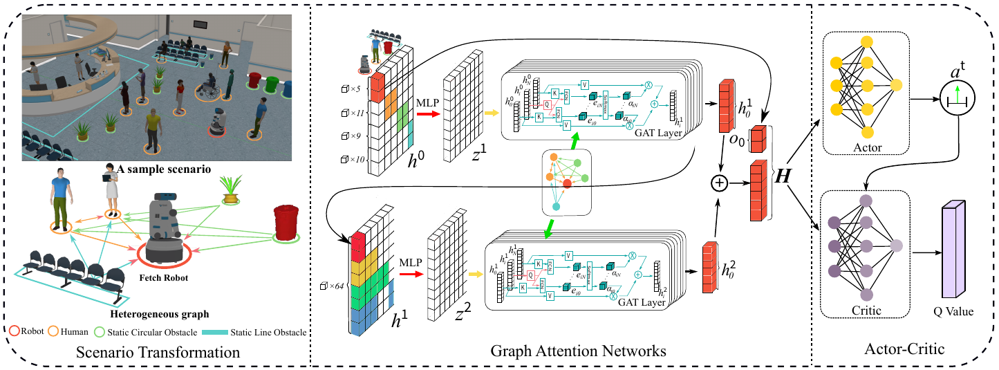
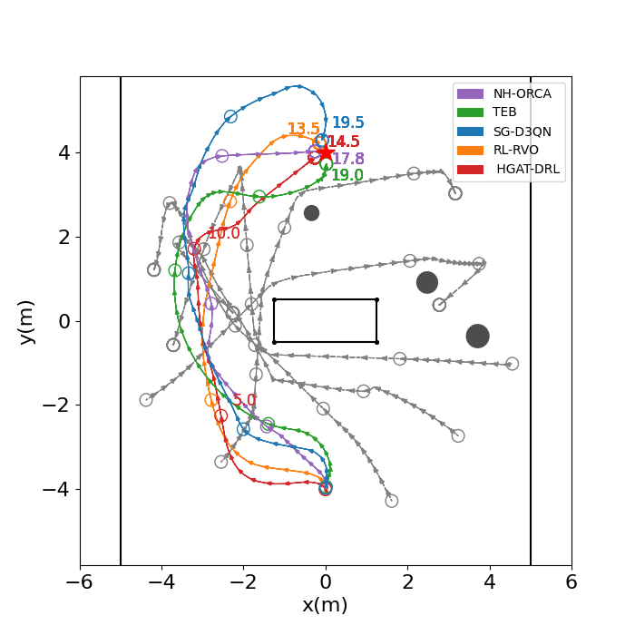
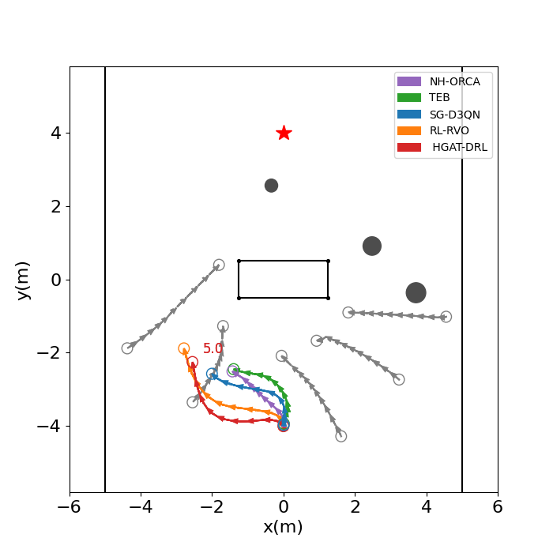
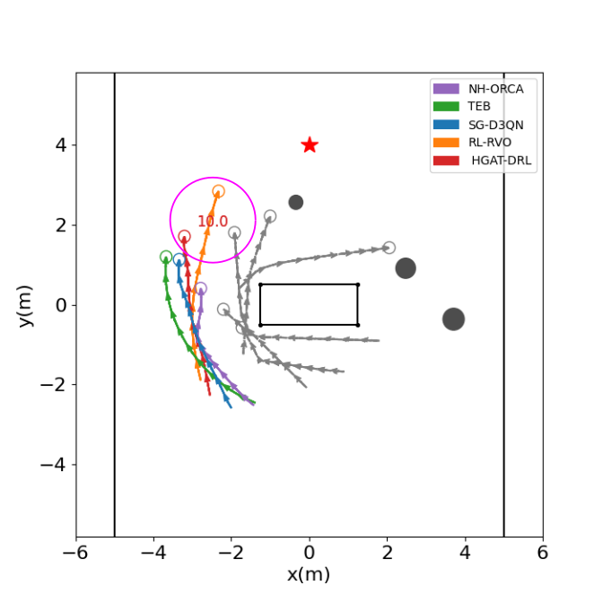
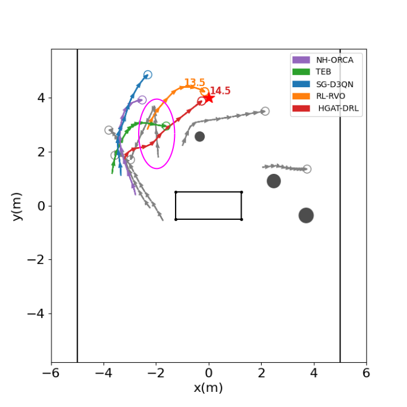

# HGAT-DRL (A heterogeneous GAT-based deep reinforcement learning algorithm for crowd robot navigation)

This repository contains the codes for our paper, 
[Navigating Robots in Dynamic Environment With Deep Reinforcement Learning](https://ieeexplore.ieee.org/document/9927468/), which has been published on IEEE Transactions on Intelligent Transportation Systems.

## Abstract
In the fight against COVID-19, many robots replace human employees in various tasks that involve a risk of infection. Among these tasks, the fundamental problem of navigating robots among crowds, named \emph{robot crowd navigation}, remains open and challenging. Therefore, we propose HGAT-DRL, a heterogeneous GAT-based deep reinforcement learning algorithm. This algorithm encodes the constrained human-robot-coexisting environment in a heterogeneous graph consisting of four types of nodes. It also constructs an interactive agent-level representation for objects surrounding the robot, and incorporates the kinodynamic constraints from the non-holonomic motion model into the deep reinforcement learning (DRL) framework. Simulation results show that our proposed algorithm achieves a success rate of 92%, at least 6\% higher than four baseline algorithms. Furthermore, the hardware experiment on a Fetch robot demonstrates our algorithm's successful and convenient migration to real robots.

## Method Overview



## Setup
1. Install [Python-RVO2](https://github.com/sybrenstuvel/Python-RVO2) library
2. Install [socialforce](https://github.com/ChanganVR/socialforce) library
2. Install crowd_sim and crowd_nav into pip
```
pip install -e .
```

## Getting Started
This repository are organized in two parts: crowd_sim/ folder contains the simulation environment and crowd_nav/ folder contains codes for training and testing the policies. Details of the simulation framework can be found [here](crowd_sim/README.md). Below are the instructions for training and testing policies, and they should be executed
inside the crowd_nav/ folder.


1. Train a policy.
```
python train.py --policy td3
```
2. Test policies with 1000 test cases.
```
python test.py --model_dir data/output
```
3. Run policy for one episode and visualize the result.
```
python test.py --policy td3 --model_dir data/output --phase test --visualize --test_case 0
```
## Trajectory Diagram
|              Complete Trajectory           |              From 0s to 5s                 |
|:------------------------------------------:|:------------------------------------------:|
|  |   |
|             From 5s to 10s                 |             From 10s to 15s                |
|:------------------------------------------:|:------------------------------------------:|
|  | |

## Citation
@ARTICLE{9927468,
  author={Zhou, Zhiqian and Zeng, Zhiwen and Lang, Lin and Yao, Weijia and Lu, Huimin and Zheng, Zhiqiang and Zhou, Zongtan},
  journal={IEEE Transactions on Intelligent Transportation Systems},
  title={Navigating Robots in Dynamic Environment With Deep Reinforcement Learning},
  year={2022},
  volume={23},
  number={12},
  pages={25201-25211},
  doi={10.1109/TITS.2022.3213604}}


## Acknowledge
This work is based on [CrowdNav](https://github.com/vita-epfl/CrowdNav) and [RelationalGraphLearning](https://github.com/ChanganVR/RelationalGraphLearning).  The authors thank Changan Chen, Yuejiang Liu, Sven Kreiss, Alexandre Alahi, Sha Hu, Payam Nikdel, Greg Mori, Manolis Savva for their works.

